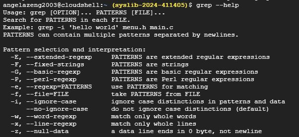

# Exploring Scopus Data with Grep
## Introduction

In this document, I will show the basic use of `grep`commands to explore Scopus database related to Library and "Adult Services." I have exported 45 results as a citation file. The file name is scopus (2).bib.

## Example Grep Queries

### 1. Search for aLlist of `grep` Commands
`grep --help` or `man grep`
This command displays a brief summary of `grep` options and their usage.

### 2. Search for an Author
`grep "author={Hughes" scopus2.bib`
The command searches for entries with "Hughes" as an author. I received 1 result.

### 3. Search for Publications on a Specific Topic
`grep -i "Library Services" scopus2.bib`
This command searches for enries with "Library Services" in the title (case matching).

